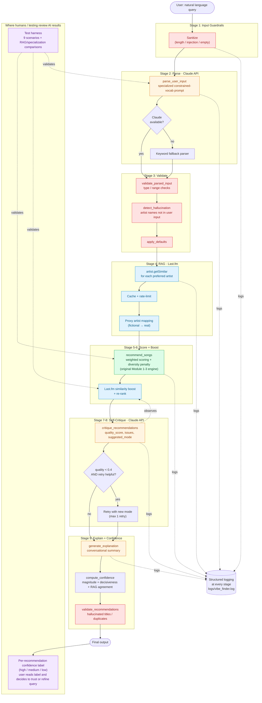

# Vibe Finder AI — System Architecture

The diagram below shows the full agentic pipeline. To render and export
to PNG, paste the Mermaid block into <https://mermaid.live> and use
"Export → PNG" with a transparent background, then save the result to
`assets/architecture.png` (already referenced from the README).



## Component summary

| Component | Module | Role |
|---|---|---|
| **Retriever** | `src/lastfm.py` | RAG: queries Last.fm `artist.getSimilar` for context |
| **Agent / Orchestrator** | `src/agent.py` | Sequences all 9 stages; owns retry loop |
| **LLM (3 specialized prompts)** | `src/llm.py` | Parse, critique, explain — each with its own system prompt |
| **Evaluator** | `src/guardrails.py` | Input/output validation, hallucination detection, confidence scoring |
| **Tester** | `tests/test_harness.py` | Scenario suite + RAG before/after + Specialization comparison |
| **Core scoring** | `src/recommender.py` | Original Module 1-3 weighted scoring engine (untouched) |
| **Logging** | `src/logger_config.py` | Structured logs at every stage to `logs/vibe_finder.log` |
| **Configuration** | `src/config.py` | API keys, thresholds, valid genre/mood lists |

## Data flow at a glance

```
NL input
   ↓ sanitize (reject empty / oversized / injection)
   ↓ Claude parse  →  fallback to keyword parser if API unavailable
   ↓ validate + apply defaults + hallucination check
   ↓ Last.fm RAG (artist.getSimilar for each mentioned artist)
   ↓ score (rule-based engine + RAG match boost)
   ↓ Claude self-critique → maybe retry with different scoring mode
   ↓ Claude conversational explanation
   ↓ confidence label per pick + output validation
   ↓ formatted table + warnings + pipeline trace
```

Every external call (Claude, Last.fm) has try/except with a graceful
fallback path. The worst-case behavior — both APIs unreachable — is the
original Module 1-3 rule-based recommender plus structured logging and
input/output guardrails.
